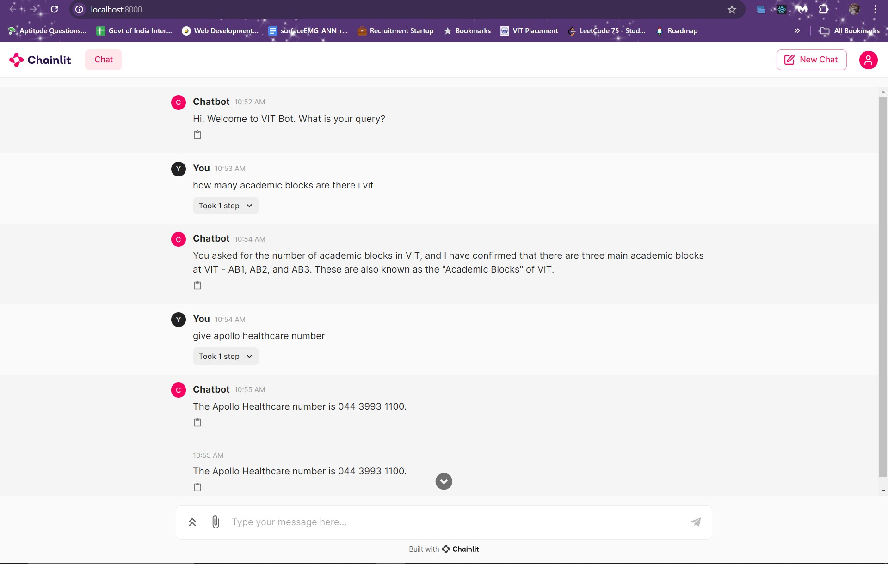

# VIT Chatbot Mini Project



Welcome to the VIT Chatbot mini project! This project provides an interactive chatbot using Chainlit and a pre-trained language model.

## Getting Started

Follow the instructions below to set up and run the chatbot on your local machine.

### Clone the Repository

First, clone the repository from GitHub using the following Git commands:

```shell
git clone https://github.com/SwastikaSoni/vit-chatbot.git
```
```shell
cd vit-chatbot
```

### Install Dependencies

After cloning the repository, install the required Python packages from the `requirements.txt` file:

```shell
pip install -r requirements.txt
```

### Download the Quantized LLM

Download the quantized Llama 2 7B Chat model file from Hugging Face:

[Download Llama 2 7B Chat model](https://huggingface.co/TheBloke/Llama-2-7B-Chat-GGML/blob/main/llama-2-7b-chat.ggmlv3.q8_0.bin)

Once downloaded, place the file `llama-2-7b-chat.ggmlv3.q8_0.bin` in the same directory as the project.

### Set Up the Python Environment

Ensure you have the correct Python environment activated. In the terminal, activate the `langchain` environment:

```shell
conda activate langchain
```

### Ingest Data

Run the data ingestion script to prepare your data:

```shell
python ingest.py
```

### Run the Chatbot

Start the chatbot using Chainlit:

```shell
chainlit run model.py -w
```

Once the application starts, you can access the chatbot in your local web browser at `http://localhost:8000`.

## Enjoy using the chatbot!

Happy chatting!
